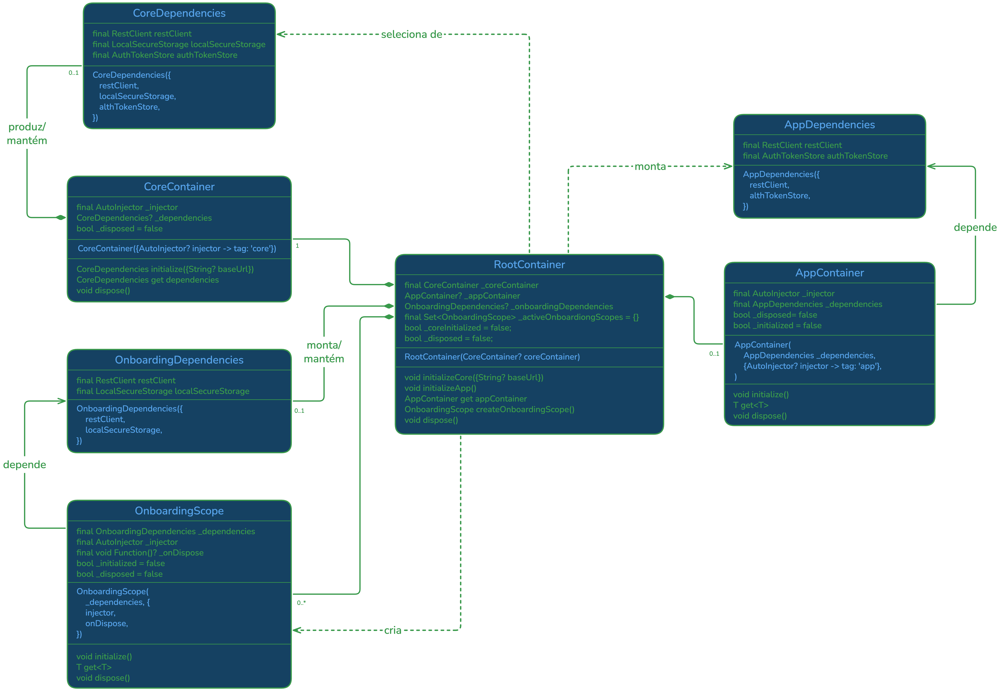

# Containers de dependências por ciclo de vida

## O problema que esta implementação resolve

Uma aplicação pode usar injeção de dependências e ainda assim manter todos os
objetos vivos durante tempo demais. Era o que acontecia quando o mobile possuía
um único `AutoInjector` global: infraestrutura, autenticação e cadastro
pertenciam ao mesmo grafo e ao mesmo ciclo de vida.

O onboarding é diferente do restante da aplicação. Ele existe somente enquanto
uma jornada de cadastro está em andamento. Seus view models e estados devem ser
criados ao entrar nesse fluxo e descartados ao sair. Ao mesmo tempo, ele precisa
usar o mesmo cliente HTTP e o mesmo armazenamento já preparados pela aplicação.

A solução separa duas ideias que costumam ser confundidas:

- **compartilhar uma instância**, como o `RestClient`;
- **compartilhar um container**, permitindo que qualquer registro fique
  acessível.

O projeto precisa da primeira, mas evita a segunda.

## Visão geral





Há três instâncias independentes de `AutoInjector`. O `RootContainer` não é uma
quarta instância: ele apenas constrói os objetos e controla seus ciclos de vida.
No diagrama, composição indica propriedade, associação indica dependência e a
seta tracejada indica produção ou criação. A ordem temporal de inicialização e
descarte é tratada separadamente nas seções seguintes.

## 1. O core cria a infraestrutura compartilhada

`CoreContainer` cria objetos fundamentais:

- `RestClient`;
- `LocalSecureStorage`;
- `AuthTokenStore`;
- Dio e o interceptor de autenticação.

Depois do `commit()`, ele devolve uma visão limitada:

```dart
class CoreDependencies {
  final RestClient restClient;
  final LocalSecureStorage localSecureStorage;
  final AuthTokenStore authTokenStore;
}
```

Essa classe não expõe `AutoInjector` nem oferece um `get<T>()`. Ela funciona
como uma lista explícita das instâncias disponíveis para composição, não como
um service locator disfarçado.

O root não entrega essa lista inteira aos demais containers. Ele seleciona
somente as referências necessárias e constrói duas visões menores:

```dart
class AppDependencies {
  final RestClient restClient;
  final AuthTokenStore authTokenStore;
}

class OnboardingDependencies {
  final RestClient restClient;
  final LocalSecureStorage localSecureStorage;
}
```

Assim, cada container declara exatamente a infraestrutura que pode acessar. Uma
nova dependência compartilhada exige uma alteração consciente na visão do
consumidor correspondente.

O core continua sendo proprietário desses objetos. App e onboarding recebem
referências a eles, mas não devem descartá-los.

## 2. O container operacional monta o aplicativo normal

`AppContainer` possui seu próprio `AutoInjector`. Ele recebe `AppDependencies`,
registra essas referências e adiciona o grafo operacional:

```dart
_injector
  ..addInstance<RestClient>(_dependencies.restClient)
  ..addInstance<AuthTokenStore>(_dependencies.authTokenStore);

registerAppBindings(_injector);
```

`app_bindings.dart` reúne os services, repositories e view models pertencentes
ao ciclo operacional. O nome deixa claro que o arquivo descreve associações do
container; ele não representa uma camada funcional da aplicação.

Isso não cria outro cliente HTTP nem outro token store. Apenas torna as mesmas
instâncias resolvíveis dentro do container do app.

Dependências de autenticação, splash e home ficam aqui. Dependências exclusivas
do cadastro não são registradas neste container.

## 3. Cada onboarding recebe um scope novo

`RootContainer.createOnboardingScope()` cria um novo `OnboardingScope` para cada
jornada. O scope encapsula um novo `AutoInjector`, no qual são registradas
somente as dependências do cadastro atual:

```text
UserService
    ↓
UserRepository
    ↓
RegisterUserViewmodel
```

O scope também recebe as referências compartilhadas de que precisa:

```dart
_injector
  ..addInstance<RestClient>(_dependencies.restClient)
  ..addInstance<LocalSecureStorage>(
    _dependencies.localSecureStorage,
  );

registerOnboardingBindings(_injector);
```

O core segue o mesmo padrão com `registerCoreBindings`. Os bindings são funções
sem estado, organizadas pelo ciclo de vida ao qual os registros pertencem.

### Bindings representam grafos, não camadas

Um registrador genérico como `registerRepositoryBindings` seria perigoso. Dois
injectors podem usar repositories diferentes, embora ambos dependam da camada
`data`. Registrar toda a camada faria cada container receber objetos que não
pertencem ao seu ciclo de vida.

Por isso, cada container possui um ponto de composição próprio:

```dart
void registerOnboardingBindings(AutoInjector injector) {
  injector
    ..add<UserService>(UserService.new)
    ..add<UserRepository>(UserRepositoryImpl.new)
    ..addSingleton<RegisterUserViewmodel>(/* ... */);
}
```

Essa função descreve o fechamento mínimo do grafo do onboarding. Outro
injector não chama esse binding automaticamente e registra apenas seu próprio
grafo.

Se surgir reutilização concreta, pode-se extrair uma capacidade menor e coesa:

```dart
void registerUserRegistrationDataBindings(AutoInjector injector) {
  injector
    ..add<UserService>(UserService.new)
    ..add<UserRepository>(UserRepositoryImpl.new);
}
```

Ainda assim, cada container escolhe explicitamente se inclui essa capacidade.
Não devem ser criados registradores globais de services, repositories, use
cases ou view models, pois a camada técnica não determina o ciclo de vida da
dependência.

Assim, dois onboardings sucessivos têm view models diferentes, mas usam o mesmo
cliente HTTP e o mesmo armazenamento do core.

O `RegisterUserViewmodel` é singleton apenas dentro de seu scope. “Singleton”,
nesse caso, não significa que ele vive por toda a execução do aplicativo. Sua
vida termina junto com a jornada que o criou.

## 4. Por que os injectors não formam uma árvore

Seria tentador fazer app e onboarding filhos do injector do core e habilitar
resolução ascendente. Porém, na versão utilizada do `AutoInjector`, a busca na
árvore pode alcançar outros descendentes. Isso abre a possibilidade de uma
dependência do onboarding ser encontrada pelo app, ou o contrário.

```text
              Core
             /    \
           App   Onboarding
             \    /
          resolução lateral
```

Os containers independentes tornam esse erro estruturalmente impossível. Se o
onboarding precisar de uma nova dependência do core, ela deve estar disponível
em `CoreDependencies`, ser selecionada pelo root e declarada em
`OnboardingDependencies`.

Essa repetição controlada de referências é intencional: ela documenta a
fronteira entre os ciclos de vida.

## 5. A navegação possui o ciclo de vida da jornada

Uma página isolada não deve criar o scope, pois o onboarding terá várias
etapas. Se cada página criasse um container, o estado seria perdido a cada
navegação.

`OnboardingScopeBoundary` fica ao redor da jornada. Em `initState`, cria uma
única instância e constrói a interface:

```dart
_scope = widget.createScope();
_journey = widget.builder(_scope);
```

O widget `_journey` é armazenado. Rebuilds da borda não recriam o scope nem o
view model. Quando a rota inteira deixa a árvore de widgets, `dispose()` encerra
o scope:

```dart
@override
void dispose() {
  _scope.dispose();
  super.dispose();
}
```

A borda resolve o view model e o entrega por construtor:

```dart
OnboardingScopeBoundary(
  createScope: rootContainer.createOnboardingScope,
  builder: (scope) => RegisterUserPage(
    viewmodel: scope.get<RegisterUserViewmodel>(),
  ),
)
```

Por isso, `RegisterUserPage` não conhece injector ou scope. Para a página,
existe apenas um `RegisterUserViewmodel` recebido normalmente.

## 6. O descarte possui uma ordem

O `RootContainer` encerra os objetos nesta ordem:

```text
scopes de onboarding ativos
           ↓
     AppContainer
           ↓
     CoreContainer
```

O onboarding e o app podem depender do core. Logo, o core deve ser o último a
ser descartado.

O root acompanha os scopes que criou. Quando um scope é encerrado pela
navegação, ele se remove dessa coleção. Se o aplicativo inteiro for encerrado
com uma jornada ainda ativa, o próprio root descarta os scopes restantes antes
de continuar.

O descarte é idempotente: chamar `dispose()` novamente não produz efeito. Após
o encerramento, `get<T>()` lança `StateError`, evitando uso acidental de um
container morto.

O `AutoInjector.dispose()` executa o callback registrado para o
`RegisterUserViewmodel`, que por sua vez descarta seu `Command`. Isso libera os
listeners pertencentes à jornada. O projeto não usa `disposeRecursive()`, pois
os três injectors não têm relação de propriedade entre si.

## 7. O papel do composition root

No bootstrap, a ordem fica visível:

```dart
final rootContainer = RootContainer();
rootContainer.initializeCore();
rootContainer.initializeApp();
runApp(AppWidget(rootContainer: rootContainer));
```

O router recebe `AppContainer` e a função
`RootContainer.createOnboardingScope`. As rotas são pontos de composição: podem
resolver o view model apropriado e entregá-lo à página. Não existe mais uma
variável global `injector` acessível em qualquer arquivo.

O root também permite outro modo de inicialização:

```dart
final root = RootContainer();
root.initializeCore();
final onboarding = root.createOnboardingScope();
```

Nesse exemplo, o onboarding funciona sem que `AppContainer` seja inicializado.
Essa propriedade permitirá iniciar uma jornada complementar sem carregar o
grafo operacional inteiro.

## 8. O que é persistido e o que é descartado

O container controla objetos em memória; ele não define sozinho a duração dos
dados armazenados.

```text
Ao sair do onboarding:

view model e listeners          → descartados
UserService e UserRepository    → descartados com o injector
rascunho no storage do core     → preservado
RestClient e AuthTokenStore     → preservados
```

Apagar o rascunho será uma decisão funcional do onboarding, por exemplo após a
conclusão bem-sucedida do cadastro. Não deve ser um efeito colateral genérico de
destruir o container.

## Como interpretar a solução

A implementação pode ser resumida por três regras:

1. o container que cria um objeto controla sua vida;
2. infraestrutura compartilhada é passada como referência explícita;
3. a borda de navegação cria e encerra o estado temporário da jornada.

O ganho não é ter mais containers. O ganho é poder responder, para cada objeto,
quem o cria, quem pode acessá-lo e quando ele deixa de existir.

## Limitação atual

Esta infraestrutura já isola corretamente o cadastro, mas o formulário atual
ainda envia `POST /users` sem a prova de verificação de e-mail exigida pela API.
O fluxo completo será implementado no backlog de onboarding. Não há bypass ou
token fictício nesta etapa.
